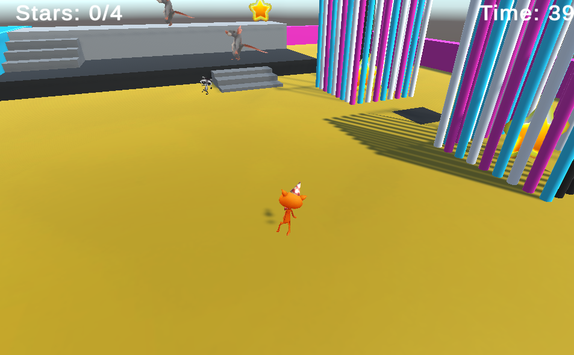

## You will make

3D adventure is the final project in the [Introduction to Unity](https://projects.raspberrypi.org/en/pathways/unity-intro){:target="_blank"} path. 

In this project, you are going to create a 3D adventure with a goal that the player needs to achieve. Your 3D adventure could be a game, a virtual world, or a visual novel with a goal and one or more endings. 

This project is brought to you with generous support from [Unity Technologies](https://unity.com/){:target="_blank"}.  These [projects](https://projects.raspberrypi.org/en/pathways/unity-intro){:target="_blank"} offer young people the opportunity to take their first steps in creating virtual worlds using Real-Time 3D.

Your project will need to meet the **project brief**.

A virtual world is a computer environment where players can explore and interact with game objects including non-player characters. A visual novel is a genre of computer game featuring a story, character development, and player choices.

You will:
+ Use your Unity skills to make a small game or experience
+ Combine 3D GameObjects, Scripts, Animations, Materials, UI, and Sounds 
+ Share your project with others so they can try it out and you can get feedback

--- no-print ---

### Play ▶️

--- task ---

   

Click on the embedded project and complete the minigame challenges. 

Think about the GameObjects including their shape, size, movement, and positions. 
+ How has `SetActive()` been used to create the cage obstacles?  
+ Would you have chosen this camera angle or used different settings? 

[Minigames](https://raspberrypilearning.github.io/unity-webgl/minigames){:target='_blank'}.

<iframe allowtransparency="true" width="710" height="450" src="https://raspberrypilearning.github.io/unity-webgl/minigames" frameborder="0"></iframe>

--- print-only ---

{:width="400px"}

--- /print-only ---

--- /task ---

--- /no-print ---

A project brief describes what a project must do. It's a bit like being given a mission to complete.

### PROJECT BRIEF: 3D adventure

Make a 3D game, virtual world, or visual novel with a goal and one or more endings.

Your project should:
+ Have a Player character and one or more non-player characters or objects
+ Have 3D scenery for the player to explore
+ Tell the player when they have finished with a win or lose message or an ending 

Your project could:
+ Have sound effects
+ Use animations to make your game objects come to life
+ Use text and/or buttons to communicate with the player and get input

--- no-print ---

### Get ideas 💭

--- task ---

Try these example projects to get ideas for what you could make. Think about how the skills you have learnt have been combined to make these games and adventures:
  
+ [Scramble trail](https://raspberrypilearning.github.io/unity-webgl/ScrambleTrail/){:target='_blank'}.
{:width="300px"}
+ [The lost rock](https://raspberrypilearning.github.io/unity-webgl/TheLostRock/){:target='_blank'}.
{:width="300px"}
+ [Star run](star-run.png){:target='_blank'}.
{:width="300px"}
+ [Home for dinner](https://raspberrypilearning.github.io/unity-webgl/HomeForDinner/){:target='_blank'}.
{:width="300px"}
+ [Crossy rat](https://raspberrypilearning.github.io/unity-webgl/CrossyRat/){:target='_blank'}.
{:width="300px"}
+ [Weather adventure](https://weather3dadventure.rpfilt.repl.co/){:target='_blank'}
{:width="300px"}
+ [Rat Queen's party](https://castle3dadventure.rpfilt.repl.co){:target='_blank'}
{:width="300px"}
  
To explore how these projects have been made, download and unzip the [Unity packages](https://rpf.io/p/en/3d-adventure-get){:target='_blank'} then import each one into an new 3D Unity project.
  
[[[unity-create-3d-project]]]

[[[unity-importing-a-package]]]
  
--- /task ---

--- /no-print ---

--- print-only ---

### Get ideas 💭

Minigames: https://raspberrypilearning.github.io/unity-webgl/minigames
{:width="300px"}

Crossy rat: https://raspberrypilearning.github.io/unity-webgl/CrossyRat/
{:width="300px"}

The lost rock: https://raspberrypilearning.github.io/unity-webgl/TheLostRock
{:width="300px"}

Home for dinner: https://raspberrypilearning.github.io/unity-webgl/HomeForDinner
{:width="300px"}
  
Scramble trail: https://scrambletrail.franksberry-pi.repl.co
{:width="300px"}

--- /print-only ---

