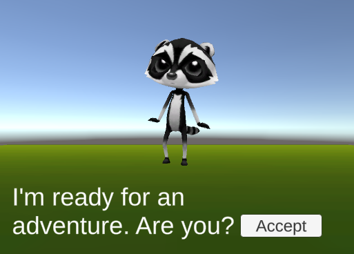
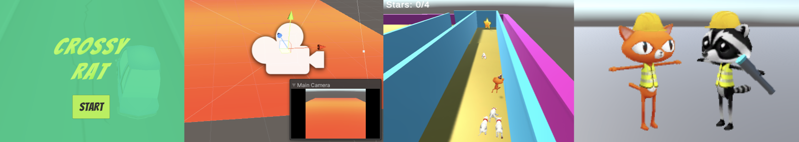
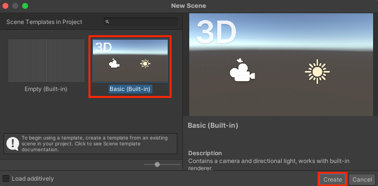

## Your idea

You can build on the world and quest that you developed in the Design projects, or if you have enough time you can start a completely new project. 

Use this step to plan your project. You can plan by just thinking, tinkering, drawing or writing, or however you like!

{:width="300px"}

"Computers are the best tool we have to think a thing, and then quickly bring that thing into the world in a way that other humans understand it." Timoni West, Unity 

### What is the goal ?

--- task ---

What is the goal of your game, mission or story?

It could be:
- Complete a set of minigames and collecting all the coins. 
- Talk to NPCs to find out who the thief was in a mystery story. 
- Find the ingredients for a firework and then reward the Player with a Particle System.

--- /task ---

### Who is it for?

--- task ---

Think about who you will make your project for (your **audience**).

--- /task ---

### Game design or experience design

Lots of popular games are written with Unity including Among Us, Pokémon Go and Pikmin Bloom, Untitled Goose Game, Beat Saber and Crossy Road. Game designers had to think about how they would make these games engaging for players. How did they do?

Use your experience to design your game:
- How will the player know how to start and what to do next? 
- What camera angle do you want?
- What NPCs will you use, how will they move, and what is their personality?
- How will the player be controlled? How will they interact with NPCs and items?
- How will you use scenery, animations and sound effects to create the right atmosphere?
- What are the important states and conditions for your game? What variables will you need to track these? 
- How will the player know when they have completed the game (by winning or losing or finding an ending)?

### Get started

--- task ---

**Choose:**

Open the project you have been working on during this Introduction to Unity path and create a new scene.

or

Download the [Unity starter package](https://rpf.io/p/en/3d-adventure-go){:target="_blank"} to your computer. Choose a sensible location such as your Documents folder. 

--- collapse ---
---
title: I don't have an existing project
---

If you have not compeleted the rest of the path, or are not able to open your previous project, you can download and import the [3D adventure](https://rpf.io/p/en/3d-adventure-go){:target=_blank} template package that contains a collection of useful assets. 

--- /collapse ---

[[[unity-importing-a-package]]]

--- collapse ---

---
title: Create a new scene
---

Go to the **File** menu and select **New Scene**. Select the `Basic (Built-in)` option and click **Create**. 

--- /collapse ---

--- /task ---

### Unity basics

--- task ---

Personalise the Unity editor to create the most efficient environment for you to create your project. 

[[[unity-customise-editor]]]

[[[unity-playmode-tint]]]

--- /task ---

--- task ---

Think about how you can make your project with the Unity skills you have learned. If there's anything that you haven't learned yet then try and adjust your ideas so you will be able to build your project. 

Note down things you don't know how to do yet so you can find out how to do them in future. 

--- /task ---

--- save ---
