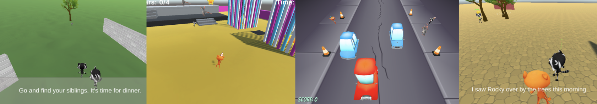
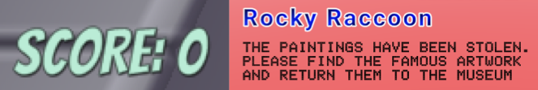

## Build and test

Now it's time to make your 3D adventure. Start small, and add more to your 3D adventure if you have time.

You have built up some really useful skills. Here is a reminder to help you make your project: 

### Unity reference

[[[unity-editor]]]

[[[unity-projects-scenes]]]

[[[unity-scene-navigation]]]

[[[unity-scene-top-down]]]

### Creating a 3D world

[[[unity-3D-coordinates]]]

[[[unity-plane]]]

[[[unity-terrain-object]]]

[[[unity-3d-objects]]]

[[[unity-model-gameobject]]]

[[[unity-transform-tools]]]

[[[unity-material-with-texture]]]

[[[unity-child-gameobjects]]]

### Add a Player character

[[[unity-npc-model]]]

[[[unity-player-character-controller]]]

[[[unity-camera-follow-player]]]

[[[unity-animation]]]

### Add NPCs and other game objects

[[[unity-gameobject-spin]]]

[[[unity-patrolling-gameobject]]]

[[[unity-follower-gameobject]]]

[[[unity-adding-tags]]]

### Collisions and triggers

[[[unity-physics-colliders]]]

[[[unity-collider-trigger]]]

### Variables and game states

[[[unity-variable-inspector]]]

[[[unity-gameobject-public-variable]]]

### Scripting game objects

[[[unity-print-console-debug]]]

[[[unity-setactive]]]

[[[unity-conditional-scripting]]]

[[[unity-time]]]

[[[unity-random-numbers]]]

### Sound and effects

[[[unity-play-sound]]]

[[[unity-add-soundtrack]]]

[[[unity-particle-system]]]

[[[unity-light-source]]]

### Text and UI

[[[unity-text-meshpro]]]

[[[unity-add-position-text]]]

[[[unity-npc-text]]]

[[[unity-button-with-onclick]]]

[[[unity-textmeshpro-variable]]]

[[[unity-update-textmeshpro]]]

--- collapse ---

---
title: Using text to finish your game
---

If you want to show a message when the player has completed your game, you can use a `TextMeshPro` object to do it. 

You will need to add a new canvas and some text that will display at the end of your game. 

Then you can use a similar approach to the Gamemaster NPC - setting the canvas as inactive at first and activating it when the player finishes the game. 

You could use your `Gamemaster` to do this, or a script on the player. 

Whichever script, you will have to add the `using TMPro;` line at the top. 

--- code ---
---
language: cs
filename: 
line_numbers: true
line_number_start: 1
line_highlights: 4
---
using System.Collections;
using System.Collections.Generic;
using UnityEngine;
using TMPro;
--- /code ---

You then need to add a variable to store the reference to the text in the script:

--- code ---
---
language: cs
filename: 
line_numbers: false
line_number_start: 
line_highlights: 
---
public TMP_Text winText;

--- /code ---

Finally, you need to be able to activate the text when the player completes the game using this line: 

--- code ---
---
language: cs
filename: 
line_numbers: false
line_number_start: 
line_highlights: 
---
winText.SetActive(true);

--- /code ---

--- /collapse ---

--- task ---

**Test:** Show someone else your project and get their feedback. Do you want make any changes? 

--- /task ---

"Play your game while you’re writing it. Play it a lot. Play it over and over. Every time you start work on your game again, begin your work session by replaying." Emily Short, Game Narrative Designer

--- task ---

**Debug:** You might find some bugs in your project that you need to fix. 

Useful debug tips:
- Turn on the Play mode tint so that you can tell when you are in Game mode.
- Click on **Gizmos** in Play mode and then click on a **GameObject** in the Inspector to view its colliders.
- Look at the values of public variables in the Inspector in Play mode to see how they are changing. 
- Use `Debug.Log()` to print messages to the Console to understand what's happening. 
- Check the Console for errors. Script errors also appear in the bar at the bottom of the editor. 

--- /task ---

[[[unity-console-error]]]

[[[unity-changes-gone]]]

[[[unity-assign-material]]]

[[[unity-camera-error]]]

[[[unity-method-absent]]]

[[[unity-collider-error]]]

[[[unity-trigger-error]]]

[[[unity-show-variables]]]

--- collapse ---

---
title: My patrolling characters do not move/face the right way
---

Think about the coordinates in your script: 
+ Are you moving along the correct `x`, `y`, `z` axis? 
+ Are you using the positive and negative values you need for your movement range?

Look at the character in the Inspector. Is your character rotated to face in the direction you wish to move?  

--- /collapse ---

You might find a bug not listed here. Can you figure out how to fix it?

We love hearing about your bugs and how you fixed them. Use the feedback button at the bottom of this page if you found a different bug in your project.

--- save ---
