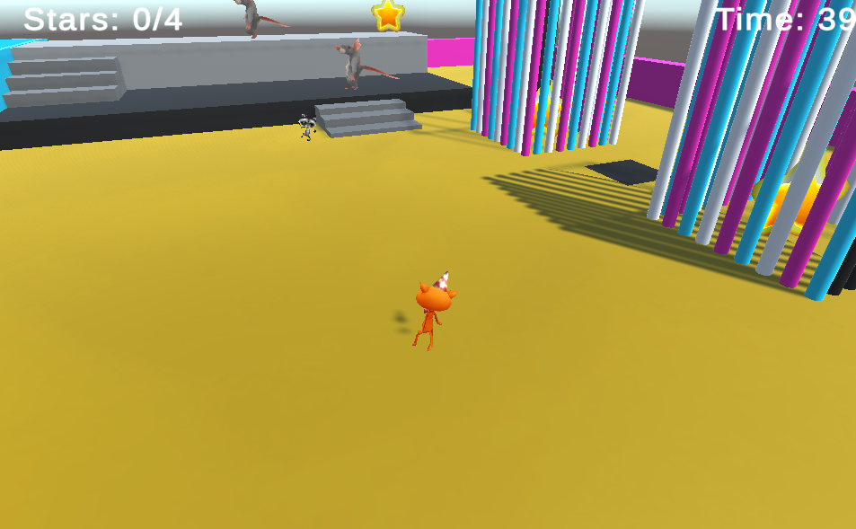
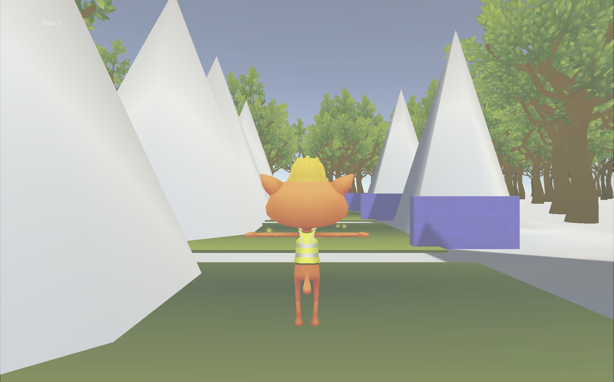
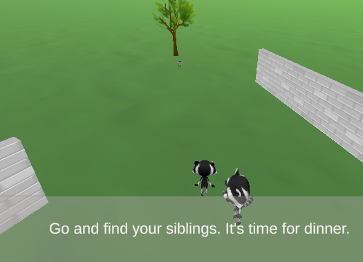
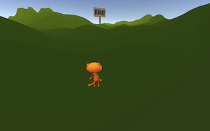
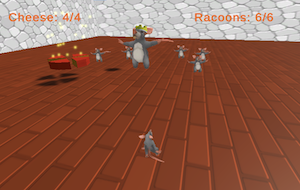

## Ce que tu vas faire

Aventure 3D est le projet final du parcours [Introduction à Unity](https://projects.raspberrypi.org/en/pathways/unity-intro){:target="_blank"}.

Dans ce projet, tu vas créer une aventure en 3D avec un objectif que le joueur doit atteindre. Ton aventure 3D peut être un jeu, un monde virtuel ou un roman visuel avec un objectif et une ou plusieurs fins.

Ce projet t'est présenté grâce au soutien généreux de [Unity Technologies](https://unity.com/){:target="_blank"}.  Ces [projets](https://projects.raspberrypi.org/en/pathways/unity-intro){:target="_blank"} proposent aux jeunes de faire leurs premiers pas dans la création de mondes virtuels en 3D temps réel.

Ton projet devra respecter la **fiche de projet**.

Un monde virtuel est un environnement informatique dans lequel les joueurs peuvent explorer et interagir avec des objets de jeu, y compris des personnages non-joueurs. Un roman visuel est un genre de jeu vidéo comportant une histoire, le développement de personnages et des choix de la part du joueur.

Tu vas :
+ Utiliser tes compétences Unity pour créer un petit jeu ou une expérience
+ Combiner des 3D GameObjects, des scripts, des animations, des matériaux, des interfaces utilisateur et des sons
+ Partager ton projet avec d'autres personnes afin qu'elles puissent l'essayer et que tu puisses recevoir leur avis

--- no-print ---

### Joue ▶️

--- task ---

Clique sur le projet intégré et relève les défis du mini-jeu.

Réfléchis aux GameObjects, notamment à leur forme, leur taille, leur mouvement et leur position.
+ Comment `SetActive()` a-t-elle été utilisée pour créer les obstacles de la cage ?
+ Aurais-tu choisi cet angle de prise de vue ou utilisé d'autres paramètres ?

[Minigames](https://raspberrypilearning.github.io/unity-webgl/minigames){:target='_blank'}.

<iframe allowtransparency="true" width="710" height="450" src="https://raspberrypilearning.github.io/unity-webgl/minigames" frameborder="0"></iframe>

--- print-only ---

{:width="400px"}

--- /print-only ---

--- /task ---

--- /no-print ---

Une fiche de projet décrit ce qu'un projet doit faire. C'est un peu comme se voir confier une mission à accomplir.

### FICHE DE PROJET : Aventure 3D

Crée un jeu en 3D, un monde virtuel ou un roman visuel avec un objectif et une ou plusieurs fins.

Ton projet doit :
+ Avoir un personnage joueur et un ou plusieurs personnages non-joueurs ou des objets
+ Avoir un décor 3D que le joueur peut explorer
+ Informer le joueur lorsqu'il a terminé avec un message de victoire ou de défaite ou une fin 

Ton projet pourrait :
+ Avoir des effets sonores
+ Utiliser des animations pour donner vie aux objets de ton jeu
+ Utiliser du texte et/ou des boutons pour communiquer avec le joueur et obtenir des informations

--- no-print ---

### Trouver des idées 💭

--- task ---

Essaie ces exemples de projets pour avoir des idées de ce que tu pourrais faire. Réfléchis à la façon dont les compétences que tu as apprises ont été combinées pour créer ces jeux et ces aventures :

+ [Scramble trail](https://raspberrypilearning.github.io/unity-webgl/ScrambleTrail/){:target='_blank'}. {:width="300px"}
+ [The lost rock](https://raspberrypilearning.github.io/unity-webgl/TheLostRock/){:target='_blank'}. {:width="300px"}
+ [Star run](star-run.png){:target='_blank'}. {:width="300px"}
+ [Home for dinner](https://raspberrypilearning.github.io/unity-webgl/HomeForDinner/){:target='_blank'}. {:width="300px"}
+ [Crossy rat](https://raspberrypilearning.github.io/unity-webgl/CrossyRat/){:target='_blank'}. {:width="300px"}
+ [Weather adventure](https://weather3dadventure.rpfilt.repl.co/){:target='_blank'}
{:width="300px"}
+ [Rat Queen's party](https://castle3dadventure.rpfilt.repl.co){:target='_blank'}
{:width="300px"}

Pour découvrir comment ces projets ont été réalisés, télécharge et décompresse les [packages Unity](https://rpf.io/p/en/3d-adventure-get){:target='_blank'} puis importe chacun d'entre eux dans un nouveau projet 3D Unity.

[[[unity-create-3d-project]]]

[[[unity-importing-a-package]]]

--- /task ---

--- /no-print ---

--- print-only ---

### Trouver des idées 💭

Minigames: https://raspberrypilearning.github.io/unity-webgl/minigames {:width="300px"}

Crossy rat: https://raspberrypilearning.github.io/unity-webgl/CrossyRat/ {:width="300px"}

The lost rock: https://raspberrypilearning.github.io/unity-webgl/TheLostRock {:width="300px"}

Home for dinner: https://raspberrypilearning.github.io/unity-webgl/HomeForDinner {:width="300px"}

Scramble trail: https://scrambletrail.franksberry-pi.repl.co {:width="300px"}

--- /print-only ---

