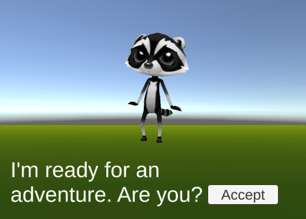
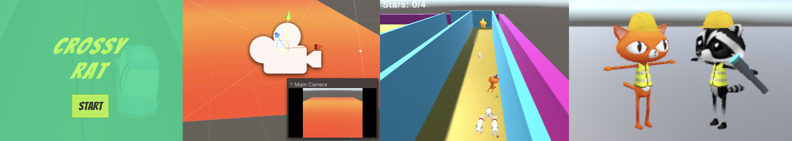

## Ton idée

Tu peux t'appuyer sur le monde et la quête que tu as développés dans les projets de conception, ou si tu as assez de temps, tu peux commencer un tout nouveau projet. 

Utilise cette étape pour planifier ton projet. Tu peux planifier simplement en pensant, en bricolant, en dessinant ou en écrivant, ou comme bon te semble !

{:width="300px"}

« Les ordinateurs sont le meilleur outil dont nous disposons pour inventer des choses et les mettre rapidement à la disposition du monde de manière à ce que d'autres humains puissent les comprendre. » Timoni West, Unity

### Quel est l'objectif ?

--- task ---

Quel est l'objectif de ton jeu, de ta mission ou de ton histoire ?

Ça pourrait être :
- Terminer une série de mini-jeux et collecter toutes les pièces
- Parler aux PNJ pour découvrir qui était le voleur dans une histoire mystérieuse
- Trouver les ingrédients nécessaires à la fabrication d'un feu d'artifice et récompenser le joueur avec un système de particules

--- /task ---

### À qui s'adresse-t-il ?

--- task ---

Réfléchis à la personne pour laquelle tu vas réaliser ton projet (ton **public**).

- Est-ce qu'ils jouent déjà beaucoup ?
- Que chercheraient-ils dans un monde en 3D ?
- Pourquoi voudraient-ils jouer à ton jeu ?

--- /task ---

### Game design ou experience design

Beaucoup de jeux populaires sont créés avec Unity, notamment Among Us, Pokémon Go, Pikmin Bloom, Untitled Goose Game, Beat Saber et Crossy Road. Les Game designers ont dû réfléchir à la manière de rendre ces jeux attrayants pour les joueurs. Comment ont-ils fait pour s'assurer que les joueurs **s'amusent** en jouant ?

Utilise ton expérience pour concevoir ton jeu :
- Comment le joueur sait-il comment commencer et que faire ensuite ?
- Quel angle de caméra veux-tu ?
- Quels PNJ utiliseras-tu, comment se déplaceront-ils et quelle est leur personnalité ?
- Comment le joueur sera-t-il contrôlé ? Comment interagiront-ils avec les PNJ et les objets ?
- Comment vas-tu utiliser les décors, les animations et les effets sonores pour créer la bonne atmosphère ?
- Quels sont les états et les conditions importants pour ton jeu ? De quelles variables auras-tu besoin pour les suivre ?
- Comment le joueur saura-t-il qu'il a terminé le jeu (en gagnant, en perdant ou en trouvant une fin) ?

### Commencer

--- task ---

**Choisir :**

Ouvre le projet sur lequel tu as travaillé pendant ce parcours d'introduction à Unity et crée une nouvelle scène.

ou

Télécharge et décompresse le [package de démarrage Unity](https://rpf.io/p/fr-FR/3d-adventure-go){:target="_blank"} sur ton ordinateur. Choisis un emplacement judicieux, par exemple ton dossier Documents.

--- collapse ---
---
title: Je n'ai pas de projet existant
---

Si tu n'as pas terminé le reste du parcours, ou si tu ne peux pas ouvrir ton projet précédent, tu peux télécharger et importer le paquet de modèles [3D adventure](https://rpf.io/p/fr-FR/3d-adventure-go){:target=_blank} qui contient une collection d'assets utiles.

--- /collapse ---

[[[unity-create-3d-project]]]

[[[unity-importing-a-package]]]

--- collapse ---

---
title: Créer une nouvelle scène
---

Va dans le menu **File** et sélectionne **New Scene**. Sélectionne l'option `Basic (Built-in)` et clique sur **Create**.

--- /collapse ---

--- /task ---

### Bases d'Unity

--- task ---

Personnalise l'éditeur Unity pour créer l'environnement le plus efficace pour la création de ton projet.

[[[unity-customise-editor]]]

[[[unity-playmode-tint]]]

--- /task ---

--- task ---

Réfléchis à la façon dont tu peux réaliser ton projet avec les compétences Unity que tu as apprises. S'il y a quelque chose que tu n'as pas encore appris, essaie d'adapter tes idées pour construire ton projet.

Note les choses que tu ne sais pas encore faire pour pouvoir trouver comment les faire à l'avenir.

--- /task ---

--- save ---
