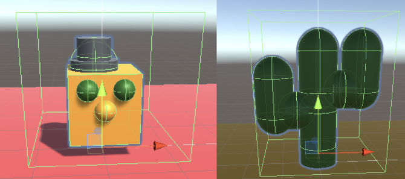

## Construire et tester

Il est temps de créer ton aventure 3D. Commence petit, et ajoute d'autres éléments à ton aventure 3D si tu as le temps.

Tu as acquis des compétences vraiment utiles. Voici un rappel pour t'aider à réaliser ton projet :

### Référence Unity

[[[unity-editor]]]

[[[unity-projects-scenes]]]

[[[unity-scene-navigation]]]

[[[unity-scene-top-down]]]

### Créer un monde 3D

[[[unity-3D-coordinates]]]

[[[unity-plane]]]

[[[unity-terrain-object]]]

[[[unity-3d-objects]]]

[[[unity-model-gameobject]]]

[[[unity-transform-tools]]]

[[[unity-material-with-texture]]]

[[[unity-child-gameobjects]]]

### Ajouter un personnage joueur

[[[unity-npc-model]]]

[[[unity-player-character-controller]]]

[[[unity-camera-follow-player]]]

[[[unity-animation]]]

### Ajouter des PNJ et d'autres objets du jeu

[[[unity-gameobject-spin]]]

[[[unity-patrolling-gameobject]]]

[[[unity-follower-gameobject]]]

[[[unity-adding-tags]]]

### Collisions et triggers

[[[unity-physics-colliders]]]

[[[unity-collider-trigger]]]

### Variables et états du jeu

[[[unity-variable-inspector]]]

[[[unity-gameobject-public-variable]]]

### Scripts pour les objets du jeu

[[[unity-print-console-debug]]]

[[[unity-setactive]]]

[[[unity-conditional-scripting]]]

[[[unity-time]]]

[[[unity-random-numbers]]]

### Son et effets

[[[unity-play-sound]]]

[[[unity-add-soundtrack]]]

[[[unity-particle-system]]]

[[[unity-light-source]]]

### Texte et UI

[[[unity-text-meshpro]]]

[[[unity-add-position-text]]]

[[[unity-npc-text]]]

[[[unity-button-with-onclick]]]

[[[unity-textmeshpro-variable]]]

[[[unity-update-textmeshpro]]]

--- collapse ---

---
title: Using text to finish your game
---

If you want to show a message when the player has completed your game, you can use a `TextMeshPro` object to do it.

You will need to add a new canvas and some text that will display at the end of your game.

Then you can use a similar approach to the Gamemaster NPC - setting the canvas as inactive at first and activating it when the player finishes the game.

You could use your `Gamemaster` to do this, or a script on the player.

Whichever script, you will have to add the `using TMPro;` line at the top.

--- code ---
---
language: cs filename: line_numbers: true line_number_start: 1
line_highlights: 4
---
using System.Collections; using System.Collections.Generic; using UnityEngine; using TMPro; --- /code ---

You then need to add a variable to store the reference to the text in the script:

--- code ---
---
language: cs filename: line_numbers: false line_number_start:
line_highlights:
---
public TMP_Text winText;

--- /code ---

Finally, you need to be able to activate the text when the player completes the game using this line:

--- code ---
---
language: cs filename: line_numbers: false line_number_start:
line_highlights:
---
winText.SetActive(true);

--- /code ---

--- /collapse ---

--- task ---

**Test :** montre ton projet à quelqu'un d'autre pour avoir son avis. Veux-tu faire des changements ?

--- /task ---

« Joue à ton jeu pendant que tu l'écris. Joues-y beaucoup. Encore et encore. Chaque fois que tu recommences à travailler sur ton jeu, commence ta séance de travail en rejouant. » Emily Short, Game Narrative Designer

--- task ---

**Débogage :** il est possible que tu trouves des bogues dans ton projet que tu dois corriger.

Astuces utiles pour le débogage :
- Active la teinte du mode Play pour que tu puisses savoir quand tu es en mode Game.
- Clique sur **Gizmos** en mode Play, puis sur un **GameObject** dans l'Inspector pour afficher ses colliders.
- Regarde les valeurs des variables publiques dans l'Inspector en mode Play pour voir comment elles changent.
- Utilise `Debug.Log()` pour imprimer des messages sur la console afin de comprendre ce qui se passe.
- Vérifie qu'il n'y a pas d'erreurs dans la console. Les erreurs de script apparaissent également dans la barre située en bas de l'éditeur.

--- /task ---

[[[unity-console-error]]]

[[[unity-changes-gone]]]

[[[unity-assign-material]]]

[[[unity-camera-error]]]

[[[unity-method-absent]]]

[[[unity-collider-error]]]

[[[unity-trigger-error]]]

[[[unity-show-variables]]]

--- collapse ---

---
title: Mes personnages en patrouille ne se déplacent pas de la bonne façon
---

Réfléchis aux coordonnées dans ton script :
+ Te déplaces-tu le long du bon axe `x`, `y`, `z` ?
+ Utilises-tu les valeurs positives et négatives dont tu as besoin pour ton amplitude de mouvement ?

Regarde le personnage dans l'Inspector. Ton personnage est-il tourné dans la direction où tu veux te déplacer ?

--- /collapse ---

Tu pourrais trouver un bogue qui n'est pas répertorié ici. Peux-tu trouver comment le résoudre ?

Nous aimerions connaître tes bogues et la façon dont tu les as résolus. Utilise le bouton Envoyer un commentaire au bas de cette page si tu as trouvé un bogue différent dans ton projet.

--- save ---
