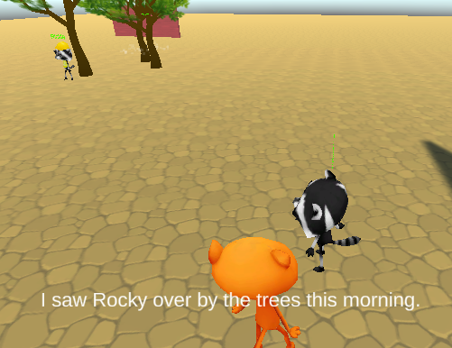

## Wat ga je maken

3D-avontuur is het laatste project in het pad [Inleiding tot Unity](https://projects.raspberrypi.org/nl-NL/pathways/unity-intro){:target="_blank"}.

In dit project ga je een 3D-avontuur maken met een doel dat de speler moet bereiken. Je 3D-avontuur kan een spel, een virtuele wereld of een visuele roman zijn met een doel en een of meer einden.

Dit project wordt je aangeboden met steun van [Unity Technologies](https://unity.com/){:target="_blank"}.  Deze [projecten](https://projects.raspberrypi.org/nl-NL/pathways/unity-intro){:target="_blank"} bieden jongeren de kans om hun eerste stappen te zetten in het maken van virtuele werelden met gebruik van Real-Time 3D.

Je project moet voldoen aan de **projectsamenvatting**.

Een virtuele wereld is een computeromgeving waarin spelers spelobjecten kunnen verkennen en ermee kunnen communiceren, inclusief niet-spelerpersonages. A visuele roman is een computerspelgenre met een verhaal, karakterontwikkeling en spelerskeuzes.

Je gaat:
+ Je Unity vaardigheden gebruiken om een spelletje of ervaring te maken
+ 3D GameObjects, scripts, animaties, materialen, gebruikersinterface en geluiden combineren
+ Je project met anderen delen zodat ze het kunnen uitproberen en je feedback kunt krijgen

--- no-print ---

### Afspelen ▶️

--- task ---

Klik op het ingebedde project en voltooi de minigame uitdagingen.

Kijk goed naar de GameObjects, inclusief hun vorm, grootte, beweging en posities.
+ Hoe is `SetActive()` gebruikt om de kooi obstakels te creëren?
+ Zou je deze camerahoek hebben gekozen of andere instellingen hebben gebruikt?

[Minigames](https://raspberrypilearning.github.io/unity-webgl/minigames){:target='_blank'}.

<iframe allowtransparency="true" width="710" height="450" src="https://raspberrypilearning.github.io/unity-webgl/minigames" frameborder="0"></iframe>

--- print-only ---

{:width="400px"}

--- /print-only ---

--- /task ---

--- /no-print ---

Een projectbeschrijving beschrijft wat een project moet doen. Het is een beetje alsof je een missie krijgt om te voltooien.

### PROJECTSAMENVATTING: 3D adventure

Maak een 3D-spel, virtuele wereld of een visuele roman met een doel en een of meer eindes.

Je project moet:
+ een speler-personage en een of meer niet-speler-personages of objecten hebben
+ een 3D-landschap hebben voor de speler om te verkennen
+ de speler vertellen wanneer deze klaar is met een win- of verlies-bericht of een einde

Je project zou:
+ geluidseffecten kunnen hebben
+ animaties gebruiken om je gameobjects tot leven te laten komen
+ tekst en/of knoppen gebruiken om met de speler te communiceren en input te krijgen

--- no-print ---

### Doe inspiratie op 💭

--- task ---

Probeer deze voorbeeldprojecten om ideeën te krijgen voor wat je zou kunnen maken. Bedenk hoe de vaardigheden die je hebt geleerd zijn gecombineerd om deze games en avonturen te maken:

+ [Scramble trail](https://scrambletrail.franksberry-pi.repl.co/){:target='_blank'}.
{:width="300px"}
+ [The lost rock](https://raspberrypilearning.github.io/unity-webgl/TheLostRock/){:target='_blank'}.
{:width="300px"}
+ [Home for dinner](https://raspberrypilearning.github.io/unity-webgl/HomeForDinner/){:target='_blank'}.
{:width="300px"}
+ [Crossy rat](https://raspberrypilearning.github.io/unity-webgl/CrossyRat/){:target='_blank'}.
{:width="300px"}
+ [Weather adventure](https://weather3dadventure.rpfilt.repl.co/){:target='_blank'}
{:width="300px"}
+ [Rat Queen's party](https://castle3dadventure.rpfilt.repl.co){:target='_blank'}
{:width="300px"}

Om te ontdekken hoe deze projecten tot stand zijn gekomen, download en unzip de [Unity packages](https://rpf.io/p/nl-NL/3d-adventure-get){:target='_blank'} en importeer ze dan een voor een in een nieuw 3D Unity project.

[[[unity-create-3d-project]]]

[[[unity-importing-a-package]]]

--- /task ---

--- /no-print ---

--- print-only ---

### Doe inspiratie op 💭

Minigames: https://raspberrypilearning.github.io/unity-webgl/minigames
{:width="300px"}

Crossy rat: https://raspberrypilearning.github.io/unity-webgl/CrossyRat/
{:width="300px"}

The lost rock: https://raspberrypilearning.github.io/unity-webgl/TheLostRock
{:width="300px"}

Home for dinner: https://raspberrypilearning.github.io/unity-webgl/HomeForDinner
{:width="300px"}

Scramble trail: https://scrambletrail.franksberry-pi.repl.co
{:width="300px"}

--- /print-only ---

