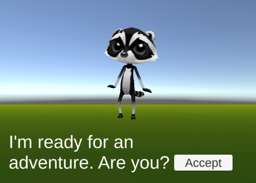
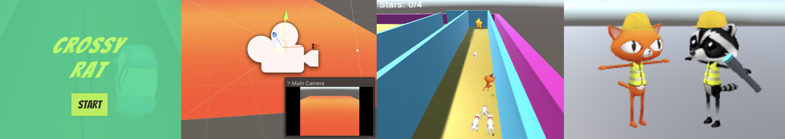
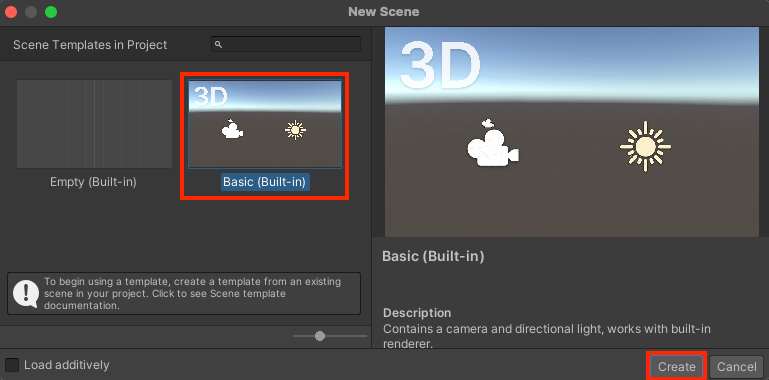

## Jouw idee

Je kunt verder bouwen op de wereld en de zoektocht die je in de Design-projecten hebt ontwikkeld, of als je genoeg tijd hebt kun je een heel nieuw project starten. 

Gebruik deze stap om je project te plannen. Je kunt het plannen door erover na te denken, te knutselen, te tekenen of te schrijven, of hoe je maar wilt!

{:width="300px"}

"Computers zijn het beste hulpmiddel om iets te bedenken, en dat vervolgens snel in de praktijk te brengen op een manier die andere mensen begrijpen." Timoni West, Unity

### Wat is het doel?

--- task ---

Wat is het doel van je spel, missie of verhaal?

Dat kan zijn:
- Maak een reeks minigames en verzamel alle munten
- Praat met NPC's om uit te zoeken wie de dief in een mysterie was
- Zoek de ingrediënten voor een vuurwerk en beloon de speler met een particle system

--- /task ---

### Voor wie is het?

--- task ---

Bedenk voor wie je je project gaat maken (je **publiek**).

- Spelen ze al veel games?
- Wat zouden ze zoeken in een 3D-wereld?
- Waarom zouden ze je spel willen spelen?

--- /task ---

### Spel design of ervaring design

Veel populaire games worden geschreven met Unity, waaronder Among Us, Pokémon Go, Pikmin Bloom, Untitled Goose Game, Beat Saber en Crossy Road. Game designers moesten goed nadenken over hoe ze deze games aantrekkelijk konden maken voor spelers. Hoe zorgden ze ervoor dat spelers **plezier** hadden tijdens het spelen?

Gebruik je ervaring om je spel te ontwerpen:
- Hoe weet de speler hoe hij moet beginnen en wat hij vervolgens moet doen?
- Welke camerahoek wil je?
- Welke NPC's ga je gebruiken, hoe gaan ze bewegen en wat is hun persoonlijkheid?
- Hoe wordt de speler bestuurd? Hoe gaan ze met NPC's en items communiceren?
- Hoe ga je landschappen, animaties en geluidseffecten gebruiken om de juiste sfeer te creëren?
- Wat zijn de belangrijke statussen en voorwaarden voor je spel? Welke variabelen heb je nodig om deze te volgen?
- Hoe weet de speler wanneer hij het spel heeft voltooid (door te winnen of te verliezen of een einde te vinden)?

### Aan de slag

--- task ---

**Kies:**

Open het project waaraan je hebt gewerkt tijdens deze inleiding tot Unity-pad en maak een nieuwe scène.

of

Download het [Unity starter package](https://rpf.io/p/nl-NL/3d-adventure-go){:target="_blank"} op je computer. Kies een geschikte locatie, zoals de map documenten.

--- collapse ---
---
title: Ik heb geen bestaand project
---

Als je de rest van het pad niet hebt voltooid, of je bent niet in staat om je vorige project te openen, dan kun je het [3D avontuur](https://rpf.io/p/nl-NL/3d-adventure-go){:target=_blank} sjabloonpakket downloaden en importeren dat een verzameling nuttige assets bevat.

--- /collapse ---

[[[unity-create-3d-project]]]

[[[unity-importing-a-package]]]

--- collapse ---

---
title: Maak een nieuwe scène
---

Ga naar het **File** menu en selecteer **New Scene**. Selecteer de optie `Basic (Built-in)` en klik op **Create**.

--- /collapse ---

--- /task ---

### Unity basisprincipes

--- task ---

Personaliseer de Unity Editor om de meest efficiënte omgeving te maken voor jou om je project te maken.

[[[unity-customise-editor]]]

[[[unity-playmode-tint]]]

--- /task ---

--- task ---

Bedenk hoe je je project kunt maken met de Unity-vaardigheden die je hebt geleerd. Als er iets is dat je nog niet hebt geleerd, probeer dan je ideeën aan te passen zodat je je project alsnog kunt bouwen.

Noteer dingen die je nog niet weet, zodat je kunt zien hoe je ze in de toekomst kunt doen.

--- /task ---

--- save ---
