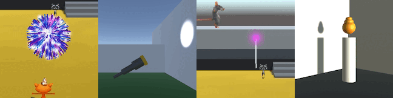

## Bouw en test

Nu is het tijd om je 3D-avontuur te maken. Begin klein en voeg meer toe aan je 3D-avontuur als je tijd hebt.

Je hebt echt nuttige vaardigheden opgebouwd. Hier is een herinnering om je te helpen bij het maken van je project:

### Unity-referentie

[[[unity-editor]]]

[[[unity-projects-scenes]]]

[[[unity-scene-navigation]]]

[[[unity-scene-top-down]]]

### Het creëren van een 3D-wereld

[[[unity-3D-coordinates]]]

[[[unity-plane]]]

[[[unity-terrain-object]]]

[[[unity-3d-objects]]]

[[[unity-model-gameobject]]]

[[[unity-transform-tools]]]

[[[unity-material-with-texture]]]

[[[unity-child-gameobjects]]]

### Voeg een Spelerpersonage toe

[[[unity-npc-model]]]

[[[unity-player-character-controller]]]

[[[unity-camera-follow-player]]]

[[[unity-animation]]]

### Voeg NPC's en andere spelobjecten toe

[[[unity-gameobject-spin]]]

[[[unity-patrolling-gameobject]]]

[[[unity-follower-gameobject]]]

[[[unity-adding-tags]]]

### Botsingen en triggers

[[[unity-physics-colliders]]]

[[[unity-collider-trigger]]]

### Variabelen en spelstatussen

[[[unity-variable-inspector]]]

[[[unity-gameobject-public-variable]]]

### Spelobjecten schrijven

[[[unity-print-console-debug]]]

[[[unity-setactive]]]

[[[unity-conditional-scripting]]]

[[[unity-time]]]

[[[unity-random-numbers]]]

### Geluid en effecten

[[[unity-play-sound]]]

[[[unity-add-soundtrack]]]

[[[unity-particle-system]]]

[[[unity-light-source]]]

### Tekst en UI

[[[unity-text-meshpro]]]

[[[unity-add-position-text]]]

[[[unity-npc-text]]]

[[[unity-button-with-onclick]]]

[[[unity-textmeshpro-variable]]]

[[[unity-update-textmeshpro]]]

--- task ---

**Test:** Laat iemand anders jouw project zien en vraag feedback. Wil je wijzigingen aanbrengen?

--- /task ---

"Speel je spel terwijl je het schrijft. Speel het vaak. Speel het keer op keer. Elke keer dat je weer aan je spel gaat werken, begin je werksessie door opnieuw te spelen." Emily Short, Game Narrative Ontwerper

--- task ---

**Fouten oplossen:** Mogelijk vind je enkele fouten in jouw project die je moet oplossen.

Handige tips voor foutopsporing:
- Schakel de tint van de afspeelmodus in zodat je kunt zien wanneer je in de spelmodus bent.
- Klik op **Gizmos** in de speelmodus en klik vervolgens op een **-Gameobject-** in de Inspector om zijn colliders te bekijken.
- Kijk naar de waarden van public variabelen in de Inspector in de Spel-modus om te zien hoe ze veranderen.
- Gebruik `Debug.Log()` om berichten naar de console af te drukken om te begrijpen wat er gebeurt.
- Controleer de console op fouten. Scriptfouten verschijnen ook in de balk onder aan de editor.

--- /task ---

[[[unity-console-error]]]

[[[unity-changes-gone]]]

[[[unity-assign-material]]]

[[[unity-camera-error]]]

[[[unity-method-absent]]]

[[[unity-collider-error]]]

[[[unity-trigger-error]]]

[[[unity-show-variables]]]

--- collapse ---

---
title: Mijn patrouillerende karakters bewegen/kijken niet in de juiste richting
---

Denk aan de coördinaten in je script:
+ Beweeg je langs de juiste `x`, `y`, `z` as?
+ Gebruik je de positieve en negatieve waarden die je nodig hebt voor je bewegingsbereik?

Kijk naar het personage in de Inspector. Is je personage gedraaid in de richting waarin je wilt bewegen?

--- /collapse ---

Je kunt een fout vinden die hier niet wordt vermeld. Kun je erachter komen hoe je het kunt oplossen?

We horen graag over je fouten en hoe je ze hebt opgelost. Gebruik de feedbackknop onderaan deze pagina als je een andere fout in je project hebt gevonden.

--- save ---
